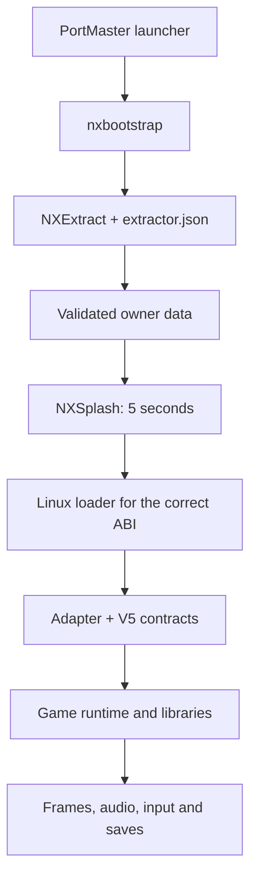

# Architecture and limitations

[Português](../pt-BR/ARQUITETURA.md)

The framework organizes environment discovery, installation, loading, compatibility and delivery. Each game's adapter connects these contracts to the actual engine. It does not automatically turn any APK into a Linux program.

## Execution path

NXExtract prepares owner data before the game starts. NXSplash is a separate, later screen displaying NEXT OS / RETRO ELITE for five seconds. Both retain their canonical interfaces. The generated launcher controls the instance and exit; a render function must not create a second window or process owner.

## Component responsibilities

| Area | Component | Port responsibility |
| --- | --- | --- |
| Entry and execution | `nxbootstrap` | Declare the correct files, ABI and adapter |
| Environment | `nxcompat` | Decide using measured capabilities and target limits |
| Loading | `nxloader`, `nxabi` | Libraries, native order, imports and ABI bridges |
| Android | `nxandroid` | Build-specific JNI classes/methods and lifecycle |
| Graphics | `nxgl` | Engine rendering, shaders, textures and real-context present |
| Sound | `nxaudio` | Mixer and OpenSL/AudioTrack/AAudio callbacks used by the game |
| Input | `nxinput` | Actual engine actions and consumers; menu/gameplay |
| Data | NXExtract | Identity, extraction, hook and validation recipe |
| Diagnostics | `nxobs`, `nxdoctor`, `nxledger` | Execution evidence and appropriately scoped conclusions |
| Composition | `nxgenerator`, `nxrelease` | Manifests, pins, corresponding source and verifiable packages |

These components are integration points, not complete implementations of every Android service. In particular, `nxandroid` is not a JVM. A required missing method remains an adapter task.

## ABI, operating system and renderer are separate decisions

`arm64-v8a` describes the Android guest; AArch64 can also execute a Linux host using glibc, but Bionic and glibc do not share every layout and contract. An extractor helper supporting x86 does not imply ARM-game emulation on x86.

Likewise, a translated logical GLES3 renderer can use physical GLES2 only for operations actually implemented. Do not advertise missing extensions. On Mali-450, measure the physical context, compiled programs and presented pixels. The [Unity guide](../../portando_unity/README.en.md) organizes these boundaries by build.

## Source, packages and data

`framework/` and the NXExtract tree are frozen exports. `ports/*/upstream/` contains source selections with their own hashes; some files required by original builds were omitted. The outer reference card and `SOURCE-MAP.json` explain the selection. The 45 titles are references, not 45 approved installations from this collection.

A new port must separate original source, preparation tools, redistributable runtime and private owner data. An extraction recipe must reproduce prepared data from a compatible local copy. A previously extracted directory does not replace that proof.

## V5 identity

Origin: tag `framework-v5`, commit `657fb65a23b5c3b20040e76307b27e6470b1d17c`. [Exported file manifest](../../publication/v5-export.json). Component `VERSION` files establish versions; historical READMEs may describe earlier revisions on the same page.

Twelve tests with private dependencies were excluded. Do not run the entire historical suite expecting a complete environment. This repository did not receive the private monorepository history. Shared behavior changes follow a separate V6 line; new guides and examples do not change existing port pins.

Continue with [AI porting](AI-PORTING.md), [Mono Android](MONO-ANDROID.md), [Godot](GODOT.md) or [Cocos2d-x](COCOS2D-X.md).
