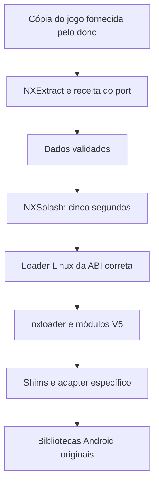

# Arquitetura e limites

A V5 reúne launcher, extração, carregamento de ELF Android, contratos de compatibilidade, vídeo, áudio, controles e ferramentas de empacotamento. Cada jogo ainda exige um adapter que implemente as interfaces e o fluxo de sua engine.

AArch64 é a rota principal. Código Android ARMv7 exige um processo apropriado e conversões de ABI onde necessárias. O suporte de um auxiliar de instalação a x86 não significa emulação de jogos ARM em CPU x86.

JNI não é apenas uma tabela de nomes. Objetos, referências, threads, exceções, assinaturas e callbacks precisam respeitar os contratos usados. nxandroid oferece contratos de lifecycle e integração; não é uma JVM completa. APIs necessárias e ainda não implementadas devem ser declaradas como bloqueio.

Um shim GLES não pode anunciar uma versão ou extensão sem implementar e testar os recursos correspondentes. Em Mali-450, provar saída GLES2 real. Para Unity, examinar versão, pipeline e formatos de textura; avaliar ETC1/dual camada com qualidade, memória e alpha preservados.

Os ports do catálogo são referências com versões e limitações próprias. O snapshot V5 é histórico e congelado. Não aplicar globalmente uma correção de um port nem chamar uma fonte parcial de jogo completo aprovado.
