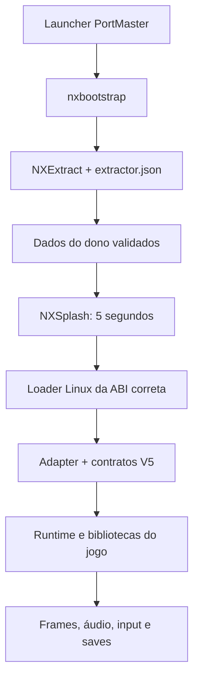

# Arquitetura e limites

[English](../en/ARCHITECTURE.md)

O framework organiza descoberta do ambiente, instalação, carregamento, compatibilidade e entrega. O adapter de cada jogo liga esses contratos à engine real. Ele não transforma qualquer APK num programa Linux automaticamente.

## Caminho de execução

NXExtract prepara os dados do dono antes de iniciar o jogo. A NXSplash é outra tela, posterior, com NEXT OS / RETRO ELITE durante cinco segundos. Ambas conservam suas interfaces canônicas. O launcher gerado controla a instância e a saída; uma função de render não deve criar um segundo dono da janela ou do processo.

## Responsabilidade por componente

| Área | Componente | Responsabilidade do port |
| --- | --- | --- |
| Entrada e execução | `nxbootstrap` | Declarar os arquivos, ABI e adapter corretos |
| Ambiente | `nxcompat` | Decidir com capacidades medidas, mantendo limites do alvo |
| Carregamento | `nxloader`, `nxabi` | Bibliotecas, ordem nativa, imports e pontes de ABI |
| Android | `nxandroid` | Classes/métodos JNI e lifecycle específicos da build |
| Imagem | `nxgl` | Render da engine, shaders, textura e present do contexto real |
| Som | `nxaudio` | Mixer e callbacks OpenSL/AudioTrack/AAudio usados pelo jogo |
| Controle | `nxinput` | Ações e consumidores reais da engine; menu/gameplay |
| Dados | NXExtract | Receita de identidade, extração, hooks e validação |
| Diagnóstico | `nxobs`, `nxdoctor`, `nxledger` | Evidências da execução e escopo correto das conclusões |
| Composição | `nxgenerator`, `nxrelease` | Manifestos, pins, fonte correspondente e pacote verificável |

Esses componentes são pontos de integração, não implementações completas de todos os serviços Android. Em particular, `nxandroid` não é uma JVM. Um método requerido e ausente continua sendo uma tarefa do adapter.

## ABI, sistema e renderer são decisões diferentes

`arm64-v8a` descreve o guest Android; AArch64 também pode executar um host Linux com glibc, mas Bionic e glibc não têm todos os mesmos layouts e contratos. O suporte x86 de um auxiliar do extrator não implica emulação de jogos ARM em x86.

Da mesma forma, um renderer lógico GLES3 traduzido pode usar GLES2 físico somente para as operações realmente implementadas. Não anunciar extensões ausentes. Em Mali-450, medir o contexto físico, os programas compilados e os pixels apresentados. O [guia Unity](../../portando_unity/README.md) organiza essas fronteiras por build.

## Fonte, pacote e dados

`framework/` e a árvore NXExtract são exportações congeladas. `ports/*/upstream/` contém seleções de fontes com hashes próprios; alguns arquivos exigidos pelos builds originais foram omitidos. A ficha externa e `SOURCE-MAP.json` explicam essa seleção. Os 44 títulos são referências, não 44 instalações aprovadas desta coleção.

O port novo deve separar fonte autoral, ferramentas de preparação, runtime redistribuível e dados privados do dono. Somente uma receita de extração permite reconstruir os dados preparados a partir da cópia local compatível. Um diretório já extraído não substitui essa prova.

## Identidade da V5

Origem: tag `framework-v5`, commit `657fb65a23b5c3b20040e76307b27e6470b1d17c`. [Manifesto dos arquivos exportados](../../publication/v5-export.json). Os arquivos `VERSION` dos componentes são a referência de versão; READMEs históricos podem descrever revisões anteriores na mesma página.

Doze testes com dependências privadas ficaram fora da exportação. Não executar a suíte histórica inteira esperando um ambiente completo. O repositório não recebeu o histórico privado do monorepositório. Mudanças de comportamento compartilhado seguem uma linha V6 separada; novos guias e exemplos não mudam os pins dos ports antigos.

Continue em [portar com IA](PORTAR-COM-IA.md), [Mono Android](MONO-ANDROID.md), [Godot](GODOT.md) ou [Cocos2d-x](COCOS2D-X.md).
