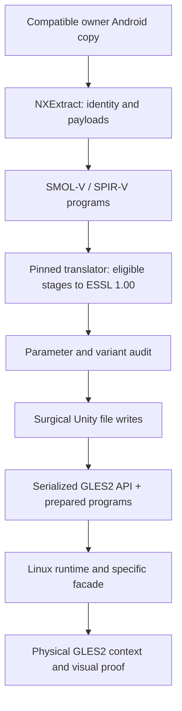

# Freedom Planet 2: from Vulkan programs to GLES2

[Português](../pt-BR/FP2-VULKAN-GLES2.md)

Freedom Planet 2 deserves its own track because the examined Android build, Unity 2018.4.36f1/IL2CPP AArch64, declares Vulkan and contains SMOL-V/SPIR-V programs. The NextOS port prepares required programs for GLES2 while installing the owner's copy. This adapts a specific build; it is not unrestricted Vulkan API support.

## 1. What was converted

The [selected public README](../../ports/fp2-nextos/upstream/README.md) describes 31 modified logical Unity files and 2,736 installed GLES2 program records. The universal route preserves the original texture corpus; it is not a general art rebake. These numbers belong to the documented profile, not a valid target for any other APK.

Data preparation and runtime-call translation solve different boundaries. Changing only the API field does not turn SPIR-V into ESSL; translating shader text alone does not implement FBOs, samplers or formats required by the runtime.

## 2. Where AI should read first

| File | Role |
| --- | --- |
| [audit_exact_gles2.py](../../ports/fp2-nextos/upstream/tools/audit_exact_gles2.py) | Inventory entries, Vulkan context, translation and program validation |
| [inject_exact_gles2.py](../../ports/fp2-nextos/upstream/tools/inject_exact_gles2.py) | Selection, eligible conversion, variant policy and narrow stencil repair |
| [serialized_patch.py](../../ports/fp2-nextos/upstream/tools/serialized_patch.py) | Preserve layout/bytes of untouched objects |
| [gles3.c](../../ports/fp2-nextos/upstream/src/gles3.c) | Logical GLES boundaries adapted to the physical context |
| [unity6_shader.c](../../ports/fp2-nextos/upstream/src/unity6_shader.c) | Program-processing support; the filename does not identify Unity version |
| [SOURCE-MAP.json](../../ports/fp2-nextos/SOURCE-MAP.json) | Exact commit and hashes of the public selection |

Scripts import dependencies such as UnityPy/LZ4 and external translation/validation tools. Read recipe arguments and versions before execution. Do not automatically upgrade these libraries against approved data without checking that serialization remains identical where required.

## 3. Preserve data structure

The pipeline must identify serialized objects, program entries, stages, attributes, uniforms, samplers and file relationships. Generic container rewriting may change unselected objects or `.splitN` fragments even when only shaders were intended to change.

Use the recipe's surgical writes for the correct serialization version. Compare untouched-object hashes/ranges, sizes and external references; reopen the result using a compatible reader. This operation belongs to NXExtract staging and must fail/rollback without destroying previous data.

## 4. Translate only defined contracts

The code contains `SKIPPED_VARIANT_POLICY`: deferred, MRT, depth, terrain or VR variants that cannot fit GLES2 representation have explicit counts/exclusions in the accepted profile. This does not authorize silently discarding a shader used by another game.

For a new build, inventory every entry and establish which programs execution needs. A new translation failure must stop preparation or remain explicitly unsupported rather than receive a generic shader that “compiles”. Preserve bindings, coordinate conventions, precision and vertex/fragment interfaces.

## 5. The number 2 and stencil case

`Sprites/StencilDraw` and `Sprites/StencilInvert` share a program carrying a `yzwx` channel rotation appropriate for the Vulkan image view. After the texture became ordinary RGBA on GLES2, that swizzle turned red into alpha; transparent padding appeared as a colored rectangle.

The repair is restricted to the translated program identity with an expected SHA. It preserves correct RGB/alpha, uses `_AlphaTex` when required and retains premultiplication. Do not remove every swizzle from every shader named “Stencil”. Another identity needs its own analysis.

Visual checks include the title's number 2, tutorial character, transparent edges and composition against scenery. Compare identical input and executable; a title screenshot with arbitrary color does not prove the corrected path.

## 6. Test beyond the first frame

Check that every required program was prepared, compiled and linked; validate scenes and transitions without magenta output or alpha leakage. Preserve the texture corpus in the documented universal route. Then test audio, input, tutorial, subsequent loading, save/reload and exit.

The public source also records a Bionic semaphore-generation repair: correct rendering does not exclude a later loading hang. Do not attribute every FP2 failure to shaders merely because it began with Vulkan.

## 7. Reuse the method

The transferable part is the method: exact inventory, eligible translation, data preservation, explicit incompatibility policy, narrow identified repairs and physical proof. Do not copy FP2 counts, offsets or exceptions into another game.

Check [license scope](../../LICENSING.en.md): the repository's MIT detection does not make every loader/hook/GLES component MIT. Port code is NextOS with third-party attribution preserved. Original shaders/assets remain owner data and are not included in this collection.
