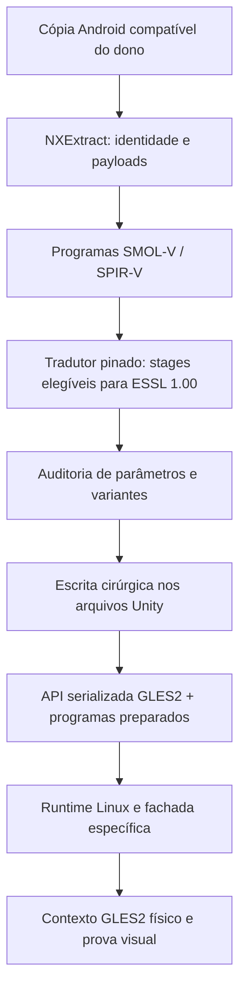

# Freedom Planet 2: dos programas Vulkan ao GLES2

[English](../en/FP2-VULKAN-GLES2.md)

O [laboratório autoral executável](../../examples/shader-lab/README.md) demonstra SMOL-V/SPIR-V → ESSL 1.00 e rejeição de compute. Ele explica quais dependências públicas foram recuperadas e por que seu pin SPIRV-Cross não substitui o pin histórico ainda não localizado do FP2.

Freedom Planet 2 merece uma trilha própria porque a build Android examinada, Unity 2018.4.36f1/IL2CPP AArch64, declara Vulkan e contém programas SMOL-V/SPIR-V. O port NextOS prepara os programas necessários para GLES2 durante a instalação da cópia do dono. O resultado é uma adaptação desta build, não suporte irrestrito à API Vulkan.

## 1. O que foi convertido

O [README público selecionado](../../ports/fp2-nextos/upstream/README.md) descreve 31 arquivos Unity lógicos alterados e 2.736 registros de programas GLES2 instalados. A rota universal preserva o conjunto original de texturas; não é um rebake geral de arte. Esses números pertencem ao perfil documentado, não são uma meta válida para qualquer outro APK.

Preparação de dados e tradução de chamadas em runtime resolvem fronteiras diferentes. Mudar somente o campo da API não transforma SPIR-V em ESSL; traduzir somente texto de shader não implementa FBO, samplers ou formatos exigidos pelo runtime.

## 2. Onde a IA deve ler primeiro

| Arquivo | Papel |
| --- | --- |
| [audit_exact_gles2.py](../../ports/fp2-nextos/upstream/tools/audit_exact_gles2.py) | Inventariar entradas, contexto Vulkan, tradução e validação de programas |
| [inject_exact_gles2.py](../../ports/fp2-nextos/upstream/tools/inject_exact_gles2.py) | Seleção, conversão elegível, política de variantes e reparo estreito de stencil |
| [serialized_patch.py](../../ports/fp2-nextos/upstream/tools/serialized_patch.py) | Preservar layout/bytes dos objetos não alterados |
| [gles3.c](../../ports/fp2-nextos/upstream/src/gles3.c) | Fronteiras lógicas GLES adaptadas ao contexto físico |
| [unity6_shader.c](../../ports/fp2-nextos/upstream/src/unity6_shader.c) | Apoio ao processamento de programas; o nome não identifica a versão Unity |
| [SOURCE-MAP.json](../../ports/fp2-nextos/SOURCE-MAP.json) | Commit e hashes exatos da seleção pública |

Os scripts importam dependências como UnityPy/LZ4 e ferramentas de tradução/validação externas. Leia os argumentos e versões da receita antes de executar. Não use uma atualização automática dessas bibliotecas em dados aprovados sem verificar se a serialização continua idêntica onde deveria.

## 3. Preservar a estrutura dos dados

O pipeline precisa identificar objetos serializados, entradas de programa, stages, atributos, uniforms, samplers e vínculos de arquivo. Uma regravação genérica do container pode alterar objetos não selecionados ou fragmentos `.splitN`, mesmo quando você pretendia mudar apenas shaders.

Use a escrita cirúrgica da receita para a versão de serialização correta. Compare hashes/intervalos dos objetos não alterados, tamanhos e referências externas; reabra o resultado pelo leitor compatível. A operação pertence ao stage do NXExtract e deve falhar/rollback sem destruir os dados anteriores.

## 4. Traduzir somente o que tem contrato

O código possui `SKIPPED_VARIANT_POLICY`: variantes de deferred, MRT, depth, terrain ou VR que não cabem na representação GLES2 têm contagens e exclusões explícitas no perfil aceito. Isso não autoriza descartar silenciosamente um shader usado por outro jogo.

Para uma nova build, inventarie todas as entradas e prove quais programas a execução exige. Uma nova falha de tradução deve interromper a preparação ou permanecer declarada como não suportada, em vez de receber um shader genérico que “compila”. Preserve bindings, convenções de coordenadas, precisão e interfaces entre vertex/fragment.

## 5. O caso do número 2 e do stencil

`Sprites/StencilDraw` e `Sprites/StencilInvert` compartilham um programa que carregava uma rotação de canais `yzwx` adequada ao image view Vulkan. Depois da textura ser RGBA comum no GLES2, o swizzle fazia vermelho virar alpha; o padding transparente aparecia como um retângulo colorido.

O reparo é limitado à identidade do programa traduzido, com SHA esperado. Ele mantém RGB/alpha corretos, usa `_AlphaTex` quando requerido e conserva a premultiplicação. Não remover todo swizzle de todos os shaders pelo nome “Stencil”. Outra identidade precisa de análise própria.

Os casos visuais para conferir incluem o número 2 no título, o personagem do tutorial, bordas transparentes e a composição com o cenário. Compare o mesmo input e executável; um screenshot de título com cor qualquer não prova o caminho corrigido.

## 6. Testar além do primeiro frame

Verifique que cada programa requerido foi preparado, compilado e linkado; valide a cena e transições, sem magenta ou vazamento de alpha. Preserve o corpus de texturas na rota universal descrita. Depois teste áudio, controles, tutorial, carregamento seguinte, save/reload e saída.

A fonte pública também registra uma correção de gerações de semáforos Bionic: imageamento correto não exclui um travamento posterior de carregamento. Não atribuir todo defeito de FP2 aos shaders por ele ter começado em Vulkan.

## 7. Reutilizar como método

O que se transfere é o método: inventário exato, tradução elegível, preservação dos dados, política explícita de incompatibilidades, reparos estreitos identificados e prova física. Não copiar contagens, offsets ou exceções de FP2 para outro jogo.

Confirme [o escopo das licenças](../../LICENSING.md): o detector MIT do repositório não torna todo loader/hooks/GLES MIT. Código do port é NextOS com as atribuições de terceiros preservadas. Shaders e assets originais continuam dados do dono e não entram nesta coleção.
